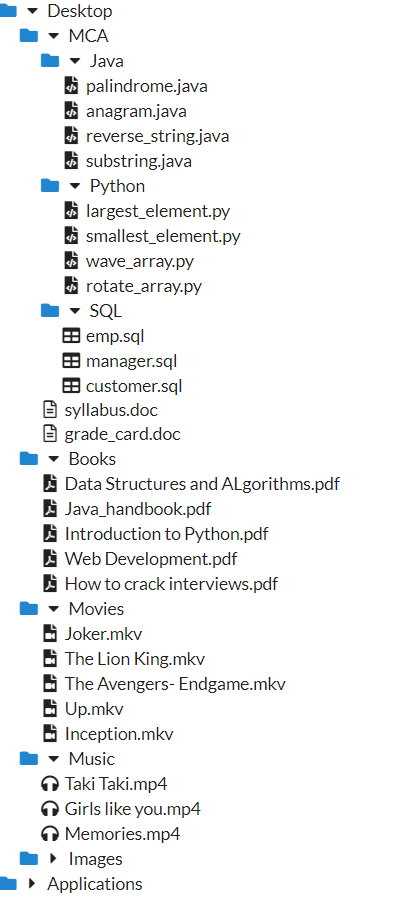

# Getting Started with 

React is a JavaScript-based library created by Facebook. It is a User Interface (UI) library tool for building UI components.

I follow the concept of learning while building. And since I don't have any existing knowledge on React, I decided to make a project on it following Alvin'youtube tutorial on **Learn React with One Project** https://www.youtube.com/watch?v=fQ1OA9Wyf2U. But obviously, this video in itself isn't sufficient enough to learn React. But as a beginner, it helped me understand the basic functionalities of React. 

So, the project is based on the file-tree structure of folders and their files, just how PCs display the folders and it's content.

## This is how it displays the representation:

## And this is how  we can navigate through it:

